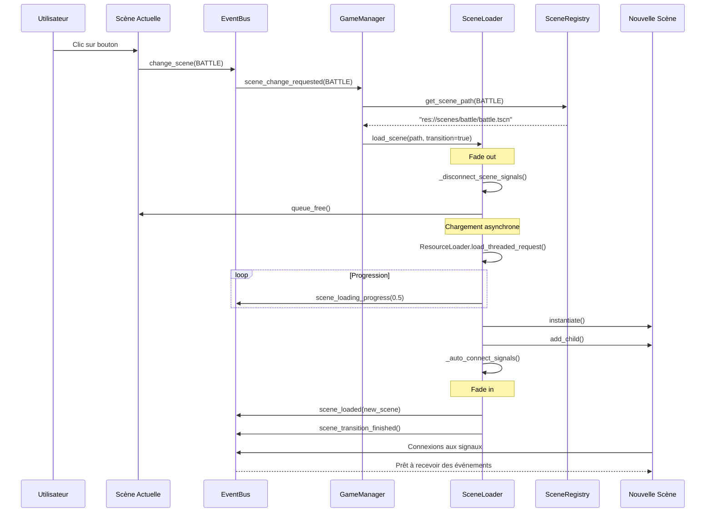
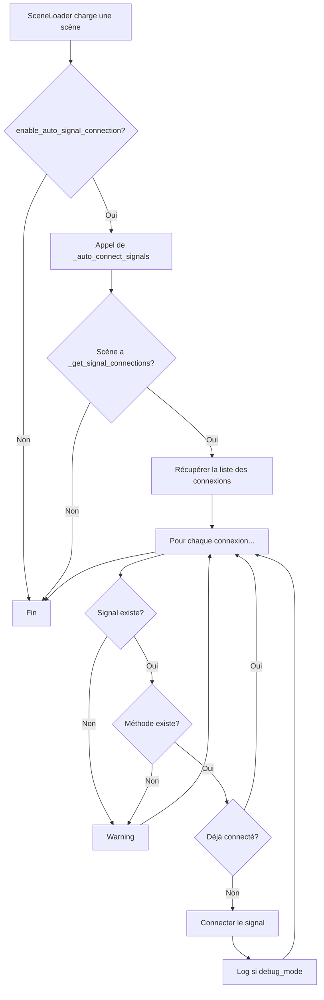
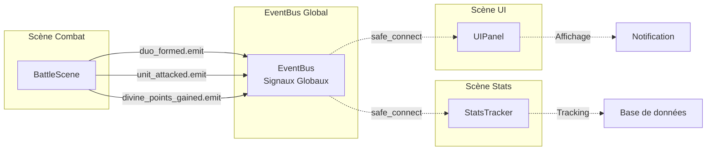
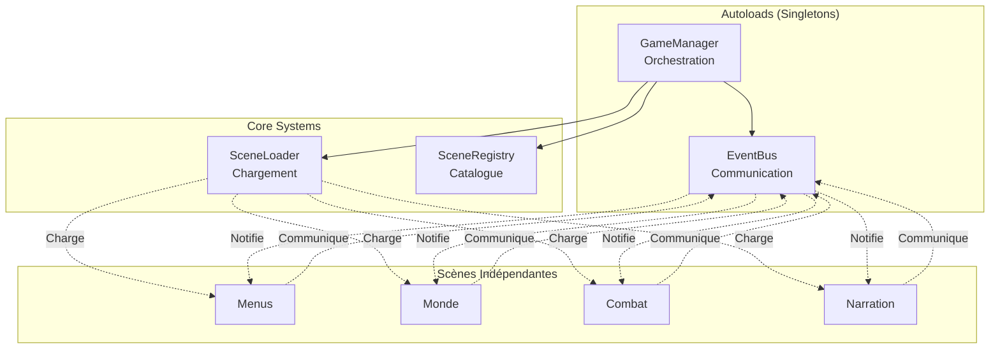
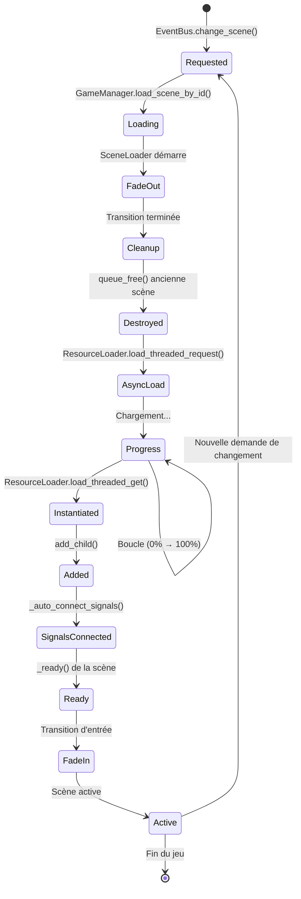
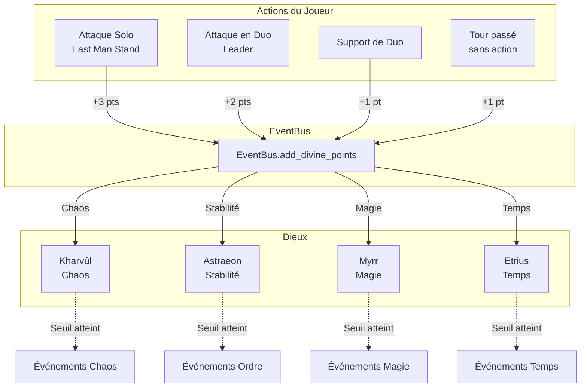
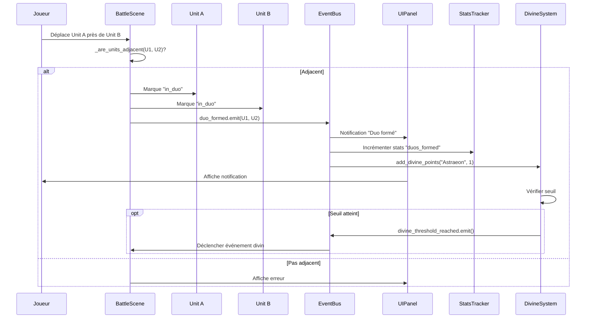

# Diagrammes du Système de Chargement

## 1. Flux de Chargement de Scène

## 2. Auto-Connexion des Signaux

## 3. Communication via EventBus

## 4. Architecture Globale

## 5. Cycle de Vie d'une Scène

## 6. Système de Foi Divine (Gameplay → Foi)

## 7. Exemple Concret : Formation d'un Duo

---

## Utilisation des Diagrammes

Ces diagrammes peuvent être visualisés :
- Sur GitHub (support natif Mermaid)
- Dans VS Code (extension Markdown Preview Mermaid)
- Sur [mermaid.live](https://mermaid.live)
- Dans la documentation générée

Ils servent à comprendre rapidement :
1. Le flux de chargement des scènes
2. L'auto-connexion des signaux
3. La communication découplée
4. Le cycle de vie complet
5. Les interactions entre systèmes
